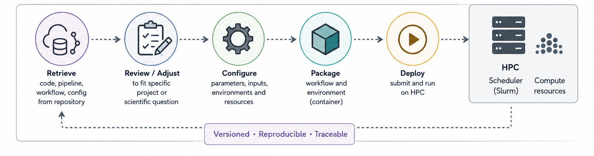

# Computing infrastructure & bioinformatics workflows

When people think about scientific computing infrastructure, they often think first about the compute cluster: CPUs, GPUs, storage capacity. But over the years, especially while running a bioinformatics core facility, I have come to think that the real challenge is not simply computing power and storage. It is designing an ecosystem where data, workflows, and users all fit together coherently.

The challenge is no longer simply:

> “Can we analyze this dataset?”

but increasingly:

> “Can we build a sustainable, reproducible, scalable ecosystem that allows many analyses, many users, and many projects to coexist efficiently over time?”

A modern bioinformatics core facility is no longer just a collection of Linux servers running analysis pipelines. It increasingly resembles a small scientific platform engineering organization, combining aspects of IT infrastructure, DevOps, software engineering, HPC, data management, scientific consulting, and statistical analysis. Unfortunately, many institutional managers still do not realize this and assume all of this can be carried by a team of two or three people.

In this post I want to sketch out what I believe is a practical architecture for a modern bioinformatics core facility and explain how a typical workflow — differential gene expression analysis from raw sequencing data to final report — fits into that infrastructure.

In many ways, this is less about individual technologies and more about the operational philosophy of modern bioinformatics: how data, workflows, infrastructure, reproducibility, and collaboration fit together into sustainable scientific systems.

# 1. Networks - the separation of concerns

Research computing infrastructure is usually distributed across multiple network segments (VLANs or subnets) to mitigate different traffic, responsibilities, and risks.

This separation is not just about security. It is also about performance and operational stability.


Any bioinformatic workflow needs to adapt to the constraints of the infrastructure and leverage optimal performance and stability.

------------------------------------------------------------------------

# 2. The data path

One of the first places where this separation becomes operationally important is the path by which data enters the infrastructure.

Large data sets should never follow this path:

```         
Internet → laptop → project storage
```

Instead they should flow like this:

```         
Internet → DMZ transfer node → validated ingest → project storage
```

The demilitarized zone - or DMZ for short - is a neutral sub network that acts as a secure buffer zone facing both the untrusted outside world (internet) and the private institutional network. It is tightly firewall controlled and key to information security. This is were Aspera, sftp and even wget/curl transfers should happen (as should checksum validation of your downloads).

The transfer node acts as a controlled gateway and is connected to the project storage, either directly or via a staging area. The transfer tools themselves should be run on the node.

Here an example ENA sequence download using `wget`:

Login to transfer node

``` bash
ssh -i \~/.ssh/id_ed25519 username\@transfer01.institute.org
```

Then run the transfer tool

```         
wget \
  -P /dmz/ingest/PROJECT_X/ \
  https://ftp.sra.ebi.ac.uk/vol1/fastq/ERR123/ERR123456/ERR123456_1.fastq.gz
```

Then validate:

```         
md5sum -c checksums.md5
```

Finally, move from staging area to project storage:

```         
rsync -avP \
  /dmz/ingest/PROJECT_X/ \
  /data/projects/PROJECT_X/raw/
```

Data sets can be extremely large, so it is vital to use the appropriate transfer protocol and ensure that enough space is available both in the staging area and in project storage.

{width="682" height="419"}

------------------------------------------------------------------------

# 3. Persistent storage and scratch

Another important distinction when dealing with high-performance computing (HPC) is between persistent storage and temporary compute storage.

Persistent project storage contains raw data (e.g. FASTQs), references, metadata, final outputs, and reports. This storage is collaborative, backed up, and long-lived. Often, a further distinction is made between immutable data such as raw sequencing data, which typically has read-only access, and active project data such as analyses, results, reports, and notebooks that allow full read/write access.

Compute workflows, on the other hand, generate enormous amounts of temporary data such as alignment intermediates, sorting chunks, caches, decompression artifacts, and other transient files. Writing all of this directly to shared project storage can quickly overload the filesystem and significantly impact performance for other users and workflows.

The standard solution is therefore to perform heavy intermediate computation on scratch storage, which is optimized for high I/O performance and, in some architectures, attached directly to the compute nodes.


In practice, workflows often stage or temporarily copy raw data onto scratch storage before computation starts. Here again, login nodes act as the entry point by providing access to mounted project storage together with scheduler access. Scratch storage itself may either be mounted cluster-wide or exist as node-local storage attached directly to individual compute nodes. Unlike persistent project storage, scratch storage is usually temporary and not backed up.

------------------------------------------------------------------------

# 4. Workflow orchestration and reproducibility

In times where FAIR principles, reproducibility, and increasingly also ISO certifications are becoming expected, a modern bioinformatics facility — or, for that matter, any bioinformatician working in a collaborative environment — should start treating workflows as production infrastructure rather than ad-hoc scripts.

For me this includes things like version control, continuous integration and deployment (CI/CD), reproducible environments, containers, automated testing, and provenance tracking. Pipelines — both software and analysis workflows — increasingly become institutional computational assets that must be maintained, versioned, validated, documented, and reproducibly deployable across projects and users.

Workflows themselves should be version controlled (e.g. using git) and hosted in systems such as GitLab, GitHub, or lightweight self-hosted alternatives like Gitea, while the actual computation is orchestrated through Slurm, containers, and workflow managers such as Nextflow or Snakemake.



Internal GitLab or Gitea instances can be tightly integrated with the computational infrastructure, CI/CD pipelines, container registries, and job submission environment. At the same time, external platforms such as [GitHub](https://github.com?utm_source=chatgpt.com) increasingly play an important role for open-source development, community contributions, public releases, documentation, and long-term sustainability of scientific software beyond individual institutes or projects.

Similarly, mature open-source ecosystems already exist around containers and standardized workflows, such as Docker registries and the nf-core repository for reusable and standardized Nextflow pipelines.

This is where a substantial change in mindset takes place. A bioinformatics unit no longer simply “runs analyses”. It maintains a reproducible computational ecosystem.

------------------------------------------------------------------------

# 5. Interactive analysis is changing

One of the biggest architectural shifts in recent years has been the move away from “desktop-centric” bioinformatics.

Traditionally, institutional storage used to be directly directly mounted to users' laptops or desktops and users worked locally using IDEs connected to remote systems, particularly for data exploration and visualization. While functional, this model often involves large data movement, dependency conflicts, inconsistent environments, and increasingly complicated support requirements. (Remember how IT sometimes needed weeks to catch up installing all your favourite R packages locally.)

More and more institutes are therefore moving interactive analysis environments directly into the infrastructure itself, deploying platforms such as [JupyterHub]{.underline}, [RStudio Server]{.underline}, [Visual Studio Code]{.underline}, and [Open OnDemand]{.underline} close to compute and storage resources. In this model, users increasingly interact through a browser rather than by directly moving data between systems.

The advantages are enormous. Data movement is reduced, dependency conflicts become easier to control, on-boarding of new users is simplified, reproducibility improves, and security governance becomes considerably more manageable. At the same time, users do no longer require powerful local workstations simply to interact with large data sets.

Most importantly, the data itself largely remains inside the institutional infrastructure. Instead of transferring entire data sets to individual machines, what usually crosses to the user’s device are rendered plots, notebook outputs, terminal streams, dashboards, and final reports. In many ways, computation increasingly moves to where the data already lives rather than the other way around.

------------------------------------------------------------------------

# 6. Sharing results and collaborative outputs

Nowadays, bioinformatics workflows increasingly produce more than static result files. Reports, dashboards, notebooks, and interactive visualizations are often shared directly with collaborators through internal web services, HTML reports, Quarto websites, or lightweight analysis portals.

Architecturally, these services usually sit close to the interactive analysis layer and are connected to project storage and computational infrastructure. Rather than transferring large datasets between collaborators, the infrastructure increasingly serves processed outputs, rendered visualizations, notebook sessions, and reproducible reports through authenticated web-based environments.

Increasingly, these systems are also connected to internal databases and data platforms that store structured metadata, processed results, project information, and searchable knowledge resources. While project storage manages the underlying files themselves, databases provide the layer that allows data, analyses, and results to become queryable, discoverable, and easier to integrate into dashboards, portals, APIs, and collaborative environments. Modern scientific infrastructure therefore increasingly depends on structured metadata systems and data platforms, not only filesystems.

This part of the infrastructure is often underestimated, yet it is arguably just as important as the computational infrastructure itself. Science that cannot be communicated, shared, explored, or reproduced is effectively invisible and, in many ways, practically non-existent. Computational workflows therefore no longer end with finished analyses, but increasingly with the generation of reproducible, accessible, and collaborative outputs that allow scientific results to be interpreted, discussed, validated, and ultimately built upon by others. For external collaborators, these services are often exposed through authenticated web portals, reverse proxies, or lightweight publication layers sitting between the internal infrastructure and the outside world. Importantly, collaborators usually interact only with processed outputs, dashboards, notebooks, and reports rather than directly accessing the underlying HPC infrastructure itself.

In many ways, the infrastructure therefore no longer only supports computation itself, but increasingly also the communication, dissemination, and reproducibility of the resulting science.

------------------------------------------------------------------------

# 7. The hidden role of the management network

The Management VLAN typically contains systems related to authentication, monitoring, logging, scheduler controllers, configuration management, backup orchestration, and increasingly also CI/CD services (e.g. GitLab). While scientific data mainly flows between storage, compute, and interactive services, the management layer quietly coordinates and supervises the entire ecosystem in the background. In many ways, it functions as the nervous system of the infrastructure.

Management of this layer is often split between traditional IT teams and scientific computing teams. The former frequently come from telecommunications or enterprise IT backgrounds and are historically more accustomed to supporting primarily Microsoft-based environments. The latter usually emerge from computational science, often somewhat self-taught in Linux systems and research computing through practical necessity rather than formal infrastructure training.

In my experience there is often a fundamental cultural rift between traditional IT and scientific computing. Traditional IT is primarily concerned with building robust, stable, highly secure, and preferably immutable infrastructure. Scientific computing, on the other hand, is part of the research process itself, where the goal is often to experiment, rapidly implement new approaches, and maintain flexibility and scalability.

Neither perspective is wrong, but they optimize for different things. Bridging these different mindsets ultimately becomes a human problem rather than a purely technical one, and good communication and interoperability between the teams are crucial for building sustainable scientific infrastructure

------------------------------------------------------------------------

# Example: Differential gene expression workflow

Putting this all together, a typical RNA-seq differential expression workflow might look something like this:


------------------------------------------------------------------------

# Final thoughts - Infrastructure as part of the scientific method

Modern bioinformatics infrastructure is becoming less about individual hardware or tools and more about building sustainable computational ecosystems that allow science itself to scale. The difficulty, in my experience, lies in the practical implementation. Conceptually, FAIR data workflows are now widely accepted and well known. However, because this ecosystem functions as a largely silent background — often invisible to researchers — the time and, importantly, the manpower required to build, operate, and maintain these systems are frequently undervalued and consequently under-supported.

I believe the way forward requires a change of culture, both among those who benefit from bioinformatics support and those who administratively and financially support it.

Without that cultural shift, bioinformatics infrastructure risks continuing to be treated as a secondary support function rather than as a core component of modern biomedical research itself. Until that changes, many institutes will continue relying on small overextended teams to support increasingly complex computational ecosystems.

Good infrastructure is often invisible when it works well. But increasingly, modern science depends on it.
