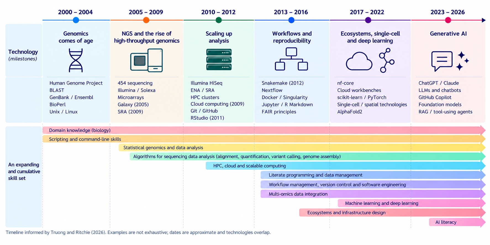

Like many bioinformaticians of my generation (and yes, it is the older one), I did not train to become one. I trained as a molecular biologist and acquired most of my computational skills while trying to solve actual research problems.

When I started my PhD in 2005, bioinformatics was already an established discipline. In fact, its roots reach back to the first computational analyses of protein sequences in the 1960s [@gauthier2019]. But formal bioinformatics degrees and clearly defined career paths were much less common than they are today. People entered the field from biology, computer science, physics, mathematics or statistics and often learned what they needed as they went along.

During my PhD, I studied microsatellite evolution in yeast in a population genomics lab. I actually started by using Visual Basic to automate tasks in Excel. When the spreadsheets could no longer hold the data and the statistics became more complex, I turned to R, which I had first learned in ecology courses for statistical modelling. As the computational side of the project grew further, I learned Perl.

There was no particular plan behind this progression. I learned what I needed when I needed it.

**Over the next twenty years, this pattern continued.** The questions changed, the technologies changed, and the scale changed. Each time, I added another layer.

## When NGS technology was still new

My transition into bioinformatics—and probably my reason for doing so—coincided with a major change in genomics.

The Human Genome Project had recently been completed, and new sequencing technologies were transforming the amount of biological data that could be generated. When I joined the CRG in 2009, RNA-seq was still very new. The first papers had appeared only shortly before, experimental protocols were becoming established, and there was not yet a mature analysis workflow that everyone simply followed.

How should reads be aligned? How should expression be quantified? How should transcript structures be handled? Which differences between samples were biological and which were introduced by the analysis itself?

Today, many of these questions have relatively established solutions. At the time, they were part of an actively developing methodological landscape. Initially, the main purpose of scripting was simply to create something that worked. New algorithms and software appeared quickly, and understanding what they did—and where they failed—was an important part of being a bioinformatician.

I encountered something similar later at CNAG when I started working with whole-genome bisulfite sequencing within BLUEPRINT. WGBS generated a different type and scale of sequencing data, and both the experimental protocols and computational approaches were still developing.

Across the field, methods for read alignment, genome assembly, transcript quantification, variant calling and many other tasks were developing rapidly. But as these individual analytical building blocks became more established, another problem became increasingly important:

**How do we execute the whole analysis reliably?**

## From scripts to workflows

A sequencing analysis is rarely a single program. Reads have to be checked, transformed, aligned or quantified; intermediate files are generated; samples have to be combined; statistical analyses follow; software versions and parameters matter.

At small scale, these steps can be connected with scripts and manual commands. At larger scale, that becomes increasingly fragile.

What happens when step eight of a twelve-step analysis fails? Can we restart without repeating everything? Which software version produced a particular result? Can somebody else run the analysis? Can I reproduce it myself six months later?

During my time at CRG and particularly later at CNAG, pipelines became an increasingly important part of my work. GRAPE supported large-scale RNA-seq analysis; later, gemBS provided a structured pipeline for whole-genome bisulfite sequencing.

The pipelines I worked with were still largely implemented using Makefiles and Bash scripts. gemBS was experimentally implemented using CWL for ENCODE, but neither I nor the teams I worked with were routinely using systems such as Snakemake or Nextflow at that stage. These were emerging and would become much more widely adopted later.

Version control and documentation also became increasingly important as analyses grew beyond disposable scripts. Literate programming offered a way to keep code, results and explanation together; in my case, R Markdown gradually became an important part of how I documented my analyses. Reproducibility was no longer only about obtaining the same statistical result. It increasingly meant being able to reconstruct how that result had been obtained.

The implementation has changed considerably since then, but the underlying problem remains familiar: once the individual analytical steps are reasonably established, attention shifts towards connecting them and making the overall analysis run smoothly, repeatedly and at scale.

The analysis was becoming part of a much larger computational landscape.

## When the data became part of the problem

Around 2010, sequencing technology leaped forward again and became faster, cheaper and even more high-throughput. The bottleneck was beginning to shift from generating data to managing and analysing it.

Files had to be stored and transferred. Samples and datasets needed metadata. Information had to be structured consistently. Increasingly large collections of data needed to be searchable, accessible and reusable. Databases were hardly new to bioinformatics, but suddenly almost every project seemed to need one, as more data were generated and more people wanted direct access to them.

The boundaries between bioinformatics and the field of data science also became increasingly blurred. Much of what we were doing was, after all, data science applied to biological questions—although with a rather specialised type of data and a substantial amount of domain knowledge attached.

Increasing scale also changed the computing underneath the analysis. HPC had long been important for computationally demanding problems, but high-throughput sequencing made scalable compute and storage part of everyday bioinformatics for many more people. Cloud computing later provided another way of accessing those resources.

## Machine learning becomes more widely used

Machine learning was not new to bioinformatics. Statistical and machine-learning methods had been used in the field for years. What changed was their reach and visibility. As biological datasets became larger, higher-dimensional and increasingly diverse, machine learning became more widely used for problems such as classification, dimensionality reduction, pattern discovery and data integration. Deep learning added another layer, particularly in areas such as imaging, sequence analysis and protein structure prediction.

This is one part of the development that I did not follow particularly closely at first. The questions I was working on kept me largely within statistical genomics, and I only moved into machine learning much later.

In a way, that is part of the story too. By this point, bioinformatics had become too broad for any one person to follow every branch equally closely.

## From workflows to systems

And I encountered yet another level.

A large sequencing centre such as the CNAG is a production environment. High-throughput projects do not begin and end with the bioinformatics pipeline. Samples, laboratory protocols, biobanking, metadata, sequencing, computational processing and data delivery have to fit into a coordinated process. A LIMS connects information across that process, while established laboratory protocols and production pipelines make it possible to handle large numbers of samples consistently.

This was quite a different perspective from working on an individual research analysis. The question was no longer only whether an analytical method worked, but how it fitted into a larger process that had to work repeatedly and at scale.

When I later led a bioinformatics core facility at IJC, I encountered the same problem from almost the opposite direction. Instead of entering an established sequencing environment, my team and I had to build many of these structures from scratch for a much smaller and more heterogeneous setting.

There were different projects, researchers and data types, all with different requirements. Projects needed sufficient metadata. Analyses needed to run consistently. Results had to be stored and communicated. Software had to be maintained. People needed documentation and training. Computational resources had to be organised.

For methylation-array projects, for example, we developed an environment in which BioForms captured project and sample information, EPipe automated the analysis, computational resources handled the processing, and MethylationDB provided structured access to results.

None of these components alone was the bioinformatics analysis. The useful system emerged from connecting them.

Increasingly, the object I was working on was not only the analysis, but also the **system around the analysis**.

## A skill set that accumulated

I think about the changing skill set of bioinformatics not as one set of skills replacing another, but as an accumulation of layers as technology developed.

::: {.wide-figure}

:::

Biological knowledge did not become less important when programming became important. Scripting did not disappear when workflow managers arrived. Statistical genomics remains fundamental even as machine learning becomes more common.

Instead, new capabilities were added. High-throughput sequencing brought new algorithms and scalable computing; increasingly complex analyses brought workflow management, version control and software-engineering practices; and newer technologies added further layers of data integration, machine learning and infrastructure.

**They accumulate.**

## There is no single modern bioinformatician

There is an obvious problem with presenting the field this way.

Taken together, the figure starts to look suspiciously like a job advertisement for an impossible person: molecular biologist, statistician, programmer, software engineer, data engineer, infrastructure specialist and machine-learning expert all at once.

That is not the point (although those job advertisements do exist).

As bioinformatics has expanded, specialisation has become both possible and necessary. Some bioinformaticians work close to biological interpretation and statistical modelling. Others specialise in methods development, scientific software, workflows, research data, computational infrastructure or machine learning.

The important change is not that every bioinformatician needs all these skills, but that modern bioinformatics depends on **all these capabilities existing somewhere within the team or organisation**.

Still, we need enough understanding of neighbouring areas to work and communicate with each other.

## Starting from a different place

Students entering bioinformatics today start from a very different position.

An undergraduate bioinformatics curriculum now includes molecular and cell biology alongside programming, algorithms, databases, biostatistics, statistical learning, computational genomics, machine learning and high-performance computing [@upcBioinformaticsCurriculum].

That breadth would have been difficult to imagine two decades ago.

But completing a course is not quite the same as dealing with the corresponding problem in practice.

Learning programming is different from maintaining software that other people depend on. Learning statistics is different from deciding what to do with a difficult experimental dataset. Learning about workflows is different from debugging one that has failed after processing hundreds of samples. And learning about reproducibility is different from trying to reproduce an analysis years later when the software, operating system and people involved have all changed.

Formal education provides a much stronger starting point today. Experience still provides something different.

Many of the skills that have mattered most in my own career developed through applying them to real problems, getting things wrong, debugging them and eventually recognising patterns in the problems that kept appearing.

At the same time, bioinformatics has become so broad, and technologies change so quickly, that keeping every part of your skill set up to date has become almost impossible. It is no longer realistic to learn every new technology in depth before we need to use it.

## And now AI changes the interface again

And now we are adding another layer.

Generative AI is changing how we interact with computational tools. Code can be generated from natural-language descriptions, unfamiliar libraries can be explored much more quickly, and AI systems are beginning to connect tools and execute parts of computational workflows.

In some ways, this may help with the very problem created by the expanding bioinformatics skill set. AI makes it easier to move into unfamiliar territory, refresh skills we have not used for a while, and work with technologies we have not had time to learn in depth.

But making something easier to execute does not necessarily make it easier to judge.

Is the analysis appropriate for the biological question? Is the generated code correct? Are the assumptions reasonable? Can the results be validated and reproduced? And what happens when an AI-generated solution is perfectly plausible and wrong?

I believe that with this shift, scientific intent, verification and critical thinking, especially with respect to computational approaches, become increasingly important.

AI may well reduce the amount of time we spend writing certain kinds of code. It seems much less likely to reduce the need to understand what an analysis is doing, how its components fit together, or whether the result makes biological sense.

## From scripts to systems

Looking back, I never made a conscious decision to move from scripts to systems.

I started with biological questions. Those questions led me to data, statistics and programming. Larger datasets led to pipelines and scalable computing. Repeated analyses made reproducibility and workflow management important. Working in a sequencing centre showed me what large-scale production looks like. Building a bioinformatics facility made me think about how data, software, infrastructure and people fit together.

Each layer appeared because the previous one was no longer enough on its own.

Perhaps that is why defining the skill set of a bioinformatician has become so difficult. Bioinformatics sits at a boundary that keeps moving as biology and technology change.

The tools will continue to change. The ability to understand the biological problem, learn what is needed to address it, and connect the necessary pieces into something that works seems rather more durable.