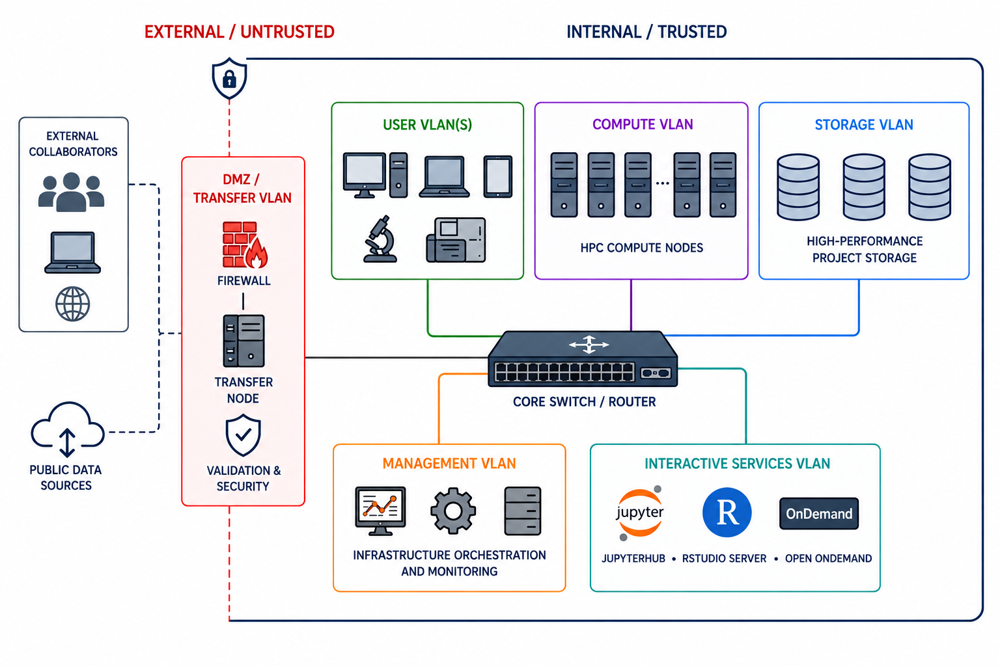
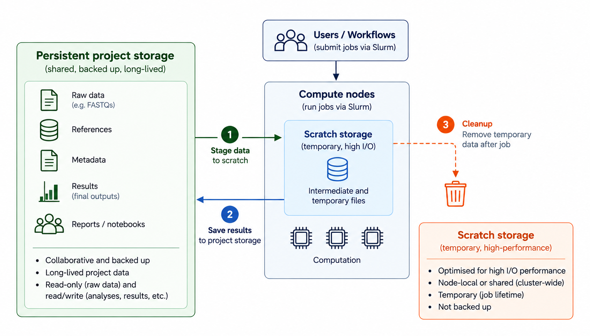
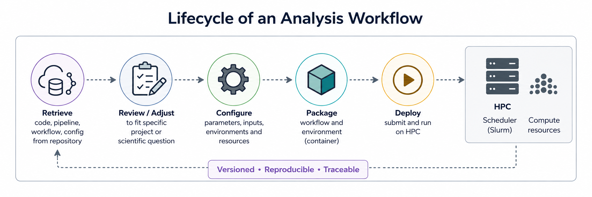
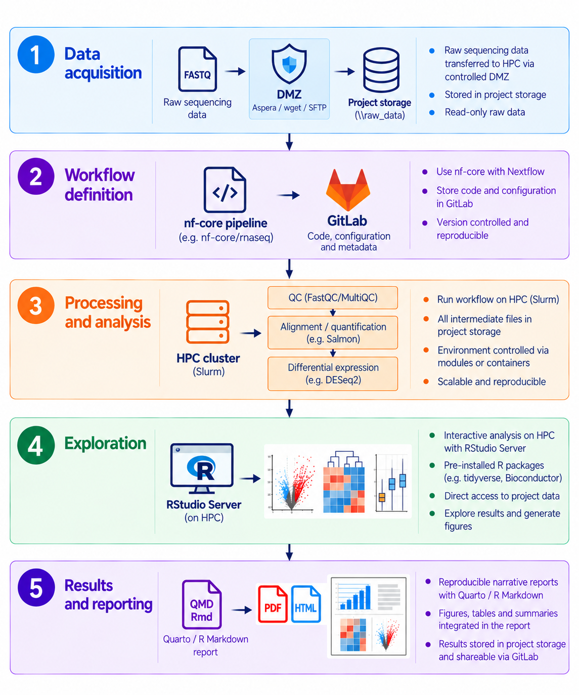

When people think about scientific computing infrastructure, they often think first about the compute cluster: CPUs, GPUs, storage capacity. But over the years, especially while running a bioinformatics core facility, I have come to think that the real challenge is not simply computing power and storage. It is designing an ecosystem where data, workflows, and users all fit together coherently.

The challenge is no longer simply:

> “Can we analyse this dataset?”

but increasingly:

> “Can we build a sustainable, reproducible, scalable ecosystem that allows many analyses, many users, and many projects to coexist efficiently over time?”

A modern bioinformatics core facility is no longer just a collection of Linux servers running analysis pipelines. It increasingly resembles a small scientific platform engineering organisation, combining aspects of IT infrastructure, DevOps, software engineering, HPC, data management, scientific consulting, and statistical analysis. Unfortunately, in my experience this breadth of responsibility is still often underestimated, with teams of two or three people expected to cover all of these areas.

In this post I want to sketch out what I believe is a practical architecture for a modern bioinformatics core facility, including networks, data flow, computation, interactive analysis and reporting, and explain how a typical workflow — differential gene expression analysis from raw sequencing data to final report — fits into that infrastructure. The architecture I describe here is based primarily on a local, institutional HPC environment. Cloud and hybrid environments introduce additional architectural considerations and are outside the scope of this post.

Ultimately, this is less about individual technologies and more about how data, workflows, infrastructure, reproducibility and collaboration come together in a sustainable bioinformatics environment.

## Networks — the separation of concerns

Like most enterprise computing infrastructure, research computing infrastructure is usually distributed across multiple network segments (VLANs or subnets) to separate different types of traffic, responsibilities, and risks (see [@chandramouli2022] for an overview of enterprise network architecture).

This separation is not just about security. It is also about performance and operational stability.



Any bioinformatics workflow needs to adapt to the constraints of the infrastructure while making effective use of the available compute, storage, and network resources.

## The data path

Most analyses start long before the first computational job is submitted: data first has to enter the infrastructure.

Large data sets should generally not follow this path:

::: {.data-path}
Internet → laptop → project storage
:::

Instead they should flow like this:

::: {.data-path}
Internet → DMZ transfer node → validated ingest → project storage
:::

The demilitarised zone — or DMZ for short — is a separate network segment that acts as a controlled buffer between the outside world and the private institutional network. It is tightly controlled by firewall rules and is key to information security. This is where tools such as `Aspera`, `SFTP`, `wget` or `curl` can be used for external data transfers, together with checksum validation of downloaded data.

The transfer node acts as a controlled gateway and is connected to the project storage, either directly or via a staging area. The transfer tools themselves should be run on the node.

To illustrate this, here is an example sequence download from the European Nucleotide Archive (ENA) using `wget` [@enaFileDownload]:

``` bash
# Login to transfer node
ssh -i \~/.ssh/id_ed25519 username\@transfer01.institute.org

# Then run the transfer tool
wget \
  -P /dmz/ingest/PROJECT_X/ \
  https://ftp.sra.ebi.ac.uk/vol1/fastq/ERR123/ERR123456/ERR123456_1.fastq.gz

# Then validate:
md5sum -c checksums.md5

# Finally, move from staging area to project storage:
rsync -avP \
  /dmz/ingest/PROJECT_X/ \
  /data/projects/PROJECT_X/raw/
```

Data sets can be extremely large, so it is vital to use the **appropriate transfer protocol** and ensure that enough space is available both in the staging area and in project storage.


| Use case                      | Typical tool    |
|-------------------------------|-----------------|
| Small files and references    | `wget` / `curl` |
| Public datasets               | `wget` / `curl` |
| Large sequencing datasets     | Aspera          |
| Collaborator exchange         | SFTP            |
| Institutional synchronisation | `rsync`         |

## Persistent storage and scratch

Once data have been ingested, attention shifts to computation and storage.

When dealing with high-performance computing, an important distinction should be made between persistent storage and temporary compute storage.

Persistent project storage contains raw data (e.g. FASTQs), references, metadata, final outputs, and reports. This storage is collaborative, backed up, and long-lived. Often, a further distinction is made between immutable data such as raw sequencing data, which typically have read-only access, and active project data such as analyses, results, reports, and notebooks that allow full read/write access.

Compute workflows, on the other hand, generate enormous amounts of temporary data such as alignment intermediates, sorting chunks, caches, decompression artefacts, and other transient files. Writing all of this directly to shared project storage can quickly overload the filesystem and significantly impact performance for other users and workflows.

The standard solution is therefore to perform heavy intermediate computation on dedicated scratch storage, which is optimised for high I/O performance and, in some architectures, attached directly to the compute nodes (see, for example, [@lumiStorage; @cinecaStorage]).



In practice, workflows often stage or temporarily copy raw data onto scratch storage before computation starts. Here again, login nodes act as the entry point by providing access to mounted project storage together with scheduler access. Scratch storage itself may either be mounted cluster-wide or exist as node-local storage attached directly to individual compute nodes. Unlike persistent project storage, scratch storage is usually temporary and not backed up.


## Workflow orchestration and reproducibility

As expectations around FAIR data, reproducibility, and quality management increase, bioinformatics facilities increasingly need to treat workflows as maintained computational infrastructure rather than collections of ad-hoc scripts [@wilkinson2016].

This includes things like version control, continuous integration and deployment (CI/CD), reproducible environments, containers, automated testing, and provenance tracking. Pipelines — both software and analysis workflows — increasingly become institutional computational assets that must be maintained, versioned, validated, documented, and reproducibly deployable across projects and users.

Workflows themselves should be version controlled (e.g. using [Git](https://git-scm.com/)) and hosted in systems such as [GitLab](https://gitlab.com/), [GitHub](https://github.com/), or lightweight self-hosted alternatives like [Gitea](https://about.gitea.com/), while the actual computation is orchestrated through [Slurm](https://slurm.schedmd.com/), containers (e.g. [Docker](https://www.docker.com/) or [Apptainer](https://apptainer.org/), formerly Singularity), and workflow managers such as [Nextflow](https://www.nextflow.io/) [@ditommaso2017] or [Snakemake](https://snakemake.github.io/) [@koster2012].



Internal GitLab or Gitea instances can be tightly integrated with the computational infrastructure, CI/CD pipelines, container registries, and job submission environment. At the same time, external platforms such as GitHub increasingly play an important role for open-source development, community contributions, public releases, documentation, and long-term sustainability of scientific software beyond individual institutes or projects.

Similarly, mature ecosystems already exist for sharing containers and standardised workflows, such as [Docker Hub](https://hub.docker.com/) for container images and [nf-core](https://nf-co.re/) for reusable and standardised Nextflow pipelines [@ewels2020].

Here is where a substantial change in mindset takes place. A bioinformatics unit no longer simply “runs analyses”. **It maintains a reproducible computational ecosystem.**


## Interactive analysis

Not every part of bioinformatics, however, can or should be turned into an automated workflow. Data still need to be explored, results inspected, code developed, and analyses adapted. Interactive analysis also needs its place within the computational infrastructure. One of the biggest architectural shifts in recent years has been the move away from “desktop-centric” bioinformatics.

Traditionally, institutional storage used to be directly mounted to users' laptops or desktops, and users worked locally using IDEs connected to remote systems, particularly for data exploration and visualisation. While functional, this model often involves large data movement, dependency conflicts, inconsistent environments, and increasingly complicated support requirements. (Remember how IT sometimes needed weeks to catch up installing all your favourite R packages locally.)

More and more institutes are therefore moving interactive analysis environments directly into the infrastructure itself, deploying platforms such as [JupyterHub](https://jupyter.org/hub), [RStudio Server](https://posit.co/products/open-source/rstudio-server/), [Visual Studio Code](https://code.visualstudio.com/), and [Open OnDemand](https://openondemand.org/) close to compute and storage resources. In this model, users increasingly interact through a browser rather than by directly moving data between systems.


This has several practical advantages. Data movement is reduced, dependency conflicts become easier to control, onboarding of new users is simplified, reproducibility improves, and security governance becomes considerably more manageable. At the same time, users no longer require powerful local workstations simply to interact with large data sets.

Most importantly, the data itself largely remains inside the institutional infrastructure. Instead of transferring entire data sets to individual machines, what usually crosses to the user's device are rendered plots, notebook outputs, terminal streams, dashboards, and final reports. In many ways, computation increasingly moves to where the data already lives rather than the other way around.


## The hidden role of the management network

Underneath all of these components is another layer that users rarely interact with directly. The management VLAN typically contains systems related to authentication, monitoring, logging, scheduler controllers, configuration management, backup orchestration, and increasingly also CI/CD services (e.g. GitLab). While scientific data mainly flow between storage, compute, and interactive services, the management layer quietly coordinates and supervises the entire ecosystem in the background. In many ways, it functions as the nervous system of the infrastructure.

Management of this layer is often split between traditional IT teams and scientific computing teams. These teams may come from quite different backgrounds and have developed around different requirements. Enterprise IT typically emphasises stability, security, standardisation, and maintainability, while scientific computing has grown around the changing computational needs of research.

In my experience, this can create a cultural gap between traditional IT and scientific computing. Traditional IT is primarily concerned with building robust, stable, highly secure, and preferably immutable infrastructure. Scientific computing, on the other hand, is part of the research process itself, where the goal is often to experiment, rapidly implement new approaches, and maintain flexibility and scalability.

Neither perspective is wrong, but they optimise for different things. Bridging these different mindsets ultimately becomes a human problem rather than a purely technical one, and good communication and interoperability between the teams are crucial for building sustainable scientific infrastructure.

## Sharing results and collaborative outputs

Finally, the results produced by these workflows have to be reviewed, shared and communicated. Nowadays, bioinformatics workflows increasingly produce more than static result files. Reports, dashboards, notebooks, and interactive visualisations are often made available to collaborators through internal web services, HTML reports, Quarto websites, or lightweight analysis portals.

Architecturally, these services usually sit close to the interactive analysis layer and are connected to project storage and computational infrastructure. Rather than transferring large datasets between collaborators, the infrastructure increasingly serves processed outputs, rendered visualisations, notebook sessions, and reproducible reports through authenticated web-based environments.

Increasingly, these systems are also connected to internal databases and data platforms that store structured metadata, processed results, project information, and searchable knowledge resources. While project storage manages the underlying files themselves, databases provide the layer that allows data, analyses, and results to become queryable, discoverable, and easier to integrate into dashboards, portals, APIs, and collaborative environments. Modern scientific infrastructure therefore increasingly depends on structured metadata systems and data platforms, not only filesystems.

This part of the infrastructure is often underestimated, yet it is arguably just as important as the computational infrastructure itself. Science that cannot be communicated, shared, explored, or reproduced is effectively invisible and, in many ways, practically non-existent. Computational workflows therefore no longer end with finished analyses, but increasingly with the generation of reproducible, accessible, and collaborative outputs that allow scientific results to be interpreted, discussed, validated, and ultimately built upon by others.

For external collaborators, these services are often exposed through authenticated web portals, reverse proxies, or lightweight publication layers sitting between the internal infrastructure and the outside world. Importantly, collaborators usually interact only with processed outputs, dashboards, notebooks, and reports rather than directly accessing the underlying HPC infrastructure itself.


In many ways, the infrastructure therefore no longer only supports computation itself, but increasingly also the communication, dissemination, and reproducibility of the resulting science.

## Practical example: from raw data to results

A typical RNA-seq differential expression workflow (here based on the [nf-core/rnaseq](https://nf-co.re/rnaseq/) pipeline [@ewels2020]) illustrates how the different parts of the infrastructure connect in practice.

{width="70%"}

## Final thoughts: Infrastructure as part of the scientific method

Modern bioinformatics infrastructure is becoming less about individual hardware or tools and more about building sustainable computational ecosystems that allow science itself to scale. The difficulty, in my experience, lies in the practical implementation. Conceptually, FAIR data practices are now widely accepted and well understood. However, because this ecosystem functions largely in the background — often invisible to researchers — the time and, importantly, the staff required to build, operate and maintain these systems are frequently underestimated and consequently under-supported.

Similarly, version control of workflows, reproducible computational environments, and the use of local and remote repositories are widely accepted as good practice. Yet implementing these practices takes time. The additional development and maintenance overhead can be substantial, particularly for small bioinformatics teams, and as a result implementation often falls behind what we know should be done.

The way forward requires a change of culture, both among those who benefit from bioinformatics support and those who administratively and financially support it. Without that cultural shift, bioinformatics infrastructure risks continuing to be treated as a secondary support function rather than as part of the scientific process itself.

Good infrastructure is often invisible when it works well. But increasingly, modern science depends on it.